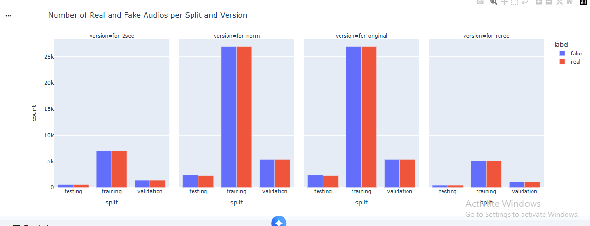
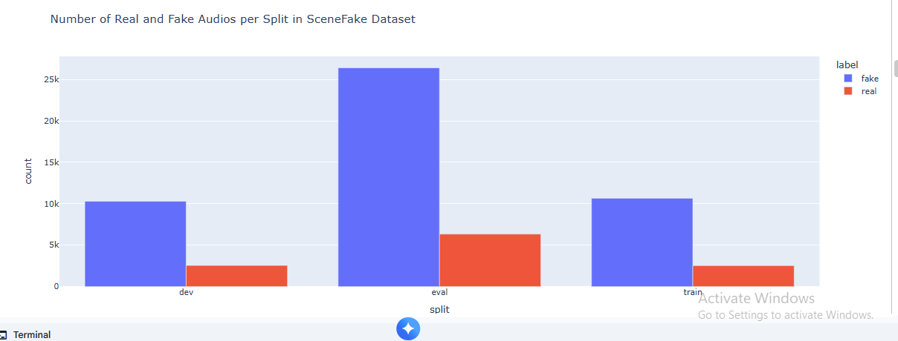
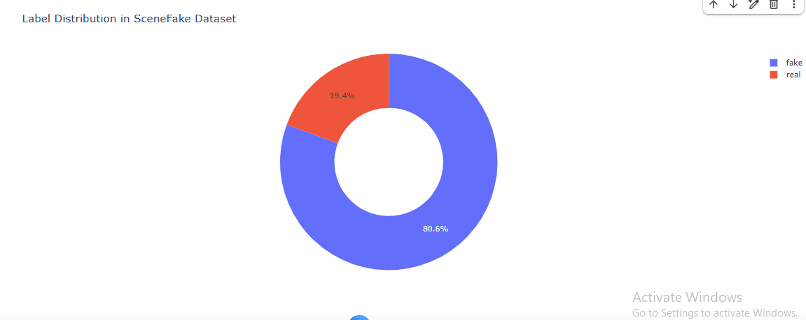

# 🎙️ Audio Deepfake Detection using Deep Learning

A Deep Learning project for detecting manipulated (deepfake) audio using the **SceneFake dataset** and the **Audio Spectrogram Transformer (AST)** architecture built with **PyTorch** and **Hugging Face Transformers**.

---

## 📌 Overview

Audio deepfakes have become an emerging cybersecurity and digital forensics challenge due to recent advances in AI-generated speech synthesis.

This project presents a transformer-based deep learning system capable of distinguishing between genuine and manipulated audio recordings using spectrogram representations extracted from the SceneFake dataset.

The complete pipeline includes audio preprocessing, feature extraction, model training, evaluation, and performance analysis.

---

## 🚀 Features

- Audio preprocessing
- Spectrogram generation
- Deep Learning-based audio classification
- Transformer-based architecture (AST)
- Multi-class audio classification
- Model evaluation using multiple metrics
- Digital Forensics application

---

## 📊 Dataset

The project uses the **SceneFake** dataset containing four audio categories:

- Scene Real
- Scene Fake
- Voice Real
- Voice Fake

The dataset is divided into:

- Training Set
- Validation Set
- Testing Set

---

## 🧠 Model Architecture

The project utilizes the **Audio Spectrogram Transformer (AST)** from Hugging Face Transformers for audio classification.

### Frameworks

- PyTorch
- Hugging Face Transformers
- Torchaudio
- Librosa

---

## 📈 Model Performance

**Best Validation Accuracy:** **98.44%**

| Metric | Score |
|---------|-------|
| Accuracy | **98.44%** |
| Precision | **98%** |
| Recall | **98%** |
| F1-Score | **98%** |

The AST model achieved excellent classification performance across all four audio classes.

---

## 📷 Results

### Number of Real and Fake Audios per Split and Version

<p align="center">

</p>

---

### SceneFake Dataset Split Distribution

<p align="center">

</p>

---

### Label Distribution

<p align="center">

</p>

---

## 📊 Evaluation

The model was evaluated using:

- Accuracy
- Precision
- Recall
- F1-score
- Classification Report

The final model achieved outstanding performance with balanced precision and recall across all classes.

---

## 🛠️ Technologies Used

- Python
- PyTorch
- Hugging Face Transformers
- AST (Audio Spectrogram Transformer)
- Torchaudio
- Librosa
- NumPy
- Pandas
- Matplotlib
- Scikit-learn
- Jupyter Notebook

---

## 📂 Project Structure

```text
Audio-Deepfake-Detection-using-Deep-Learning/
│
├── images/
│   ├── real_fake_split_version.png
│   ├── scenefake_split_distribution.png
│   └── label_distribution.png
│
├── Forensic Science Project.ipynb
├── README.md
└── requirements.txt
```

---

## ⚙️ Installation

```bash
git clone https://github.com/Meriam-aziz/Audio-Deepfake-Detection-using-Deep-Learning.git

cd Audio-Deepfake-Detection-using-Deep-Learning

pip install -r requirements.txt
```

---

## ▶️ Run the Project

```bash
jupyter notebook "Forensic Science Project.ipynb"
```

---

## 💡 Future Improvements

- Support real-time audio deepfake detection
- Fine-tune larger transformer models
- Deploy the model using Streamlit or Flask
- Extend the system to detect additional manipulated audio types
- Export the model as an inference API

---

## 👩‍💻 Author

**Meriam Aziz**

Artificial Intelligence Engineer

If you found this project useful, don't forget to ⭐ the repository.
